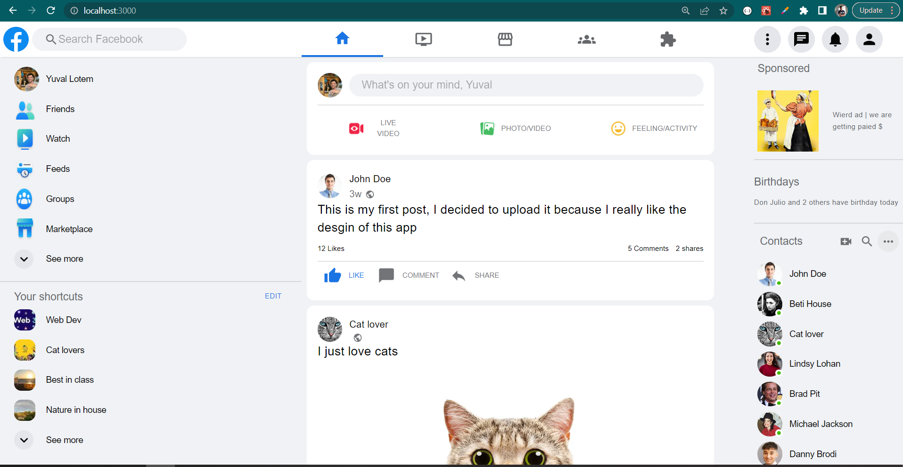

## Nextboox
Facebook mock created with next.js 13

desktop design:



## Getting Started on your local computer

First clone this project

Second, run the development server:

```bash
npm run dev
# or
yarn dev
```

Then Open [http://localhost:3000](http://localhost:3000) with your browser to see the result.

Enjoy!


